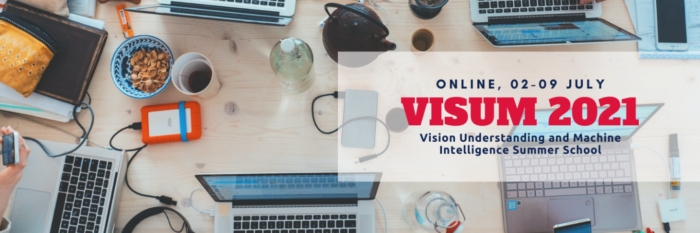

# visum-2021

Hello and welcome to the VISUM 2021 Repository.
Here the materials for the VISUM 2021 summer school will be shared throughout the week.

## Notes:

### Basics
Computer Vision with Deep Learning by Luís Teixeira - [Slides](https://drive.google.com/file/d/1FMBehM0hHxcDo7wi9tokGErN5hJlPc-p/view?usp=sharing)

Machine Learning with Python and Sklearn by Wilson Silva and Tiago Gonçalves - [Slides](basics/VISUM_basics_Machine_Learning_with_Python_and_Sklearn.pdf), [Google Colaboratory Notebook](https://colab.research.google.com/drive/1ZXYpsBx6y74LULldLLgwcFNdHRkoixtf?usp=sharing)

PyTorch and Tensorflow by Tiago Gonçalves - [Google Colaboratory Notebook](https://colab.research.google.com/drive/1rFqDKcUQaXBO_z6Xoht3taggcbLi47-n?usp=sharing)

Introduction to Bayesian Networks by Diogo Pernes - [Slides](https://github.com/visum-summerschool/visum-2021/blob/main/basics/VISUM_basics_Introduction_Bayesian_Networks.pdf)

### AI-Shots
The Learning Spectrum by Kelwin Fernandes - [Slides](https://github.com/visum-summerschool/visum-2021/blob/main/ai-shots/AS1_VISUM__Learning_Spectrum.pdf)

Embedding Domain Knowledge in DNN by Kelwin Fernandes - [Slides](https://github.com/visum-summerschool/visum-2021/blob/main/ai-shots/AS2_VISUM__Embedding_Domain_Knowledge.pdf)

Diving into an AI use case by Kelwin Fernandes, Ricardo Sousa, Pedro Ferreira, Carolina Afonso and Henning Müller - [Slides](https://github.com/visum-summerschool/visum-2021/blob/main/ai-shots/AS3_VISUM__Diving_Into_an_AI_Use_Case.pdf)

### Image Retrieval by Henning Müller
(Medical) Image Retrieval by Henning Müller - [Slides](https://github.com/visum-summerschool/visum-2021/blob/main/image-retrieval/presentationVisumSummerSchool2021_Henning.pdf)

Hands-on Session by João R. Pinto, Leonardo Capozzi and Bruno Veloso - [Google Colaboratory Notebook](https://bit.ly/visum_image_retrieval_complete)

### Image Understanding by Hugo Proença
* The dataset can be found [here](https://drive.google.com/file/d/1MDXSL97hyr6daBZUHdqJxGi8XL7S7StQ/view?usp=sharing).

### Graph Neural Networks by Michael Bronstein
Hands-on Session by Ana Rebelo, Eduardo Castro, and Diogo Pernes - [Jupyter Notebook](https://github.com/visum-summerschool/visum-2021/blob/main/graph-neural-networks/Hands_On_Session.ipynb)

## For Project Related please go to:
https://github.com/visum-summerschool/visum-competition2021
